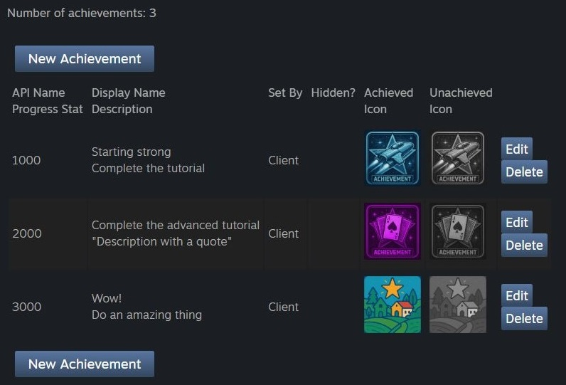

# Steam Achievement Uploader

## The problem
In order to configure Achievements for their Steam games, developers need to interact with the below UI on the Steam Partner page:<br>

<br>
*Screenshot from https://partner.steamgames.com/apps/achievements/*

Achievements need to be entered manually, one at a time, requiring several clicks per achievement. For games with a large number of achievements, this is a tedious process. Additionally, the "Unachieved" icon for a game is nearly always implemented as a desaturated version of the "Achieved" icon, and yet both must be uploaded.

This repo presents a C# solution containing tools for Steam app developers to automate their achievement configuration.

## Projects

This repository contains two related tools:

### [AchievementUploader](AchievementUploader/README.md)
The main command-line tool that automates the process of defining achievements for Steam applications by:
- Reading achievement data from CSV files
- Uploading achievement icons (achieved and unachieved states)
- Creating or updating achievements via Steam's partner API
- Optionally generating greyscale _unachieved images automatically

### [ImageProcessor](ImageProcessor/README.md)
A standalone utility that generates greyscale (desaturated) versions of achievement images for the unachieved state. This functionality is also available as an option in the main AchievementUploader tool.

## Quick Start

For most users, the `AchievementUploader` tool with the `--generate-images` option provides a complete solution:

1. Visit [Steamworks](https://partner.steamgames.com/apps/achievements/) and sign in. 
1. Open your browser dev tools (probably F12) and look for "Storage" or "Cookies"
1. Make a note of the values of `sessionid` and `steamLoginSecure`. The app will use these values to authenticate as you.
1. Navigate to the `AchievementUploader` directory
1. Build the project: `dotnet build`
1. Run with your data: 
   ```bash
   dotnet run -- --csv achievements.csv --images ./achievements --session-id <your-session> --steam-login-secure <your-login> --app-id <your-app-id> --generate-images
   ```

See the [AchievementUploader README](AchievementUploader/README.md) for detailed usage instructions.

## Sample data

The repository includes sample data to demonstrate the expected format:
- `data/achievements.csv` - Example achievement definitions
- `data/` - Sample achievement icons

## Requirements

- .NET 8.0 or later
- Valid Steam Partner account with app access
